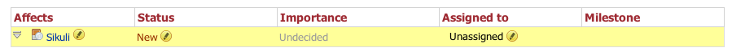

How to get involved
===================

Have fun working with Sikuli? You can do more than just being a user!
There are many ways you can help Sikuli's development:

* Blog or tweet about Sikuli. Share your cool Sikuli scripts to the world and
  let more people know how cool Sikuli is.
* Report bugs or request new features in our `bug tracker <https://bugs.launchpad.net/sikuli>`_.
* Visit `the question board <https://answers.launchpad.net/sikuli>`_ and 
  `the bug tracker <https://bugs.launchpad.net/sikuli>`_ regularly and
  answer people's questions there. 
  (You may want to `subscribe to the bug tracker <https://bugs.launchpad.net/sikuli/+subscribe>`_ or `subscribe to all questions <https://answers.launchpad.net/sikuli/+answer-contact>`_.)
  Many people have questions that you may know how to deal with. Help them
  to get through the obstacles and they may help you in the future.
* :ref:`Submit patches <submit-patches>` to fix bugs or add features.
* Join the `sikuli-dev mailing list <https://lists.csail.mit.edu/mailman/listinfo/sikuli-dev>`_ and share your ideas to us.
* Translate Sikuli into your language and help more people who speak 
  different languages to access Sikuli. You can help us to

  * translate Sikuli IDE's interface and messages, or

  * translate Sikuli documentation (this site you are reading).

  Read :ref:`translate-sikuli` for more details.

    

.. _submit-patches:

Submit Patches
--------------

If you are interested in making Sikuli better, submitting patches is a
good start. We welcome any patches to Sikuli's code. If you've found
a bug, submitting a bug report with associated patches will get it
fixed more quickly than those without patches.

Claim a bug
^^^^^^^^^^^

Here is a typical bug report status.

If you see a bug that you think you could fix, feel free to claim the bug.
Simply click the pencil icon under the "Assigned to" column, and then click
"Assign Me". Claiming a bug let other people and developers know that this
bug is being worked on, and prevents duplicate work.

Bug claimers' responsibility
^^^^^^^^^^^^^^^^^^^^^^^^^^^^

Once you've claimed a bug, you are responsible to work on that bug in 
reasonable time, say one or two weeks. 
If you don't have time to work on it, please unclaim it.

If you’ve claimed a bug and it’s taking a long time to code, 
please keep everybody updated by posting comments on the bug. 
If you don’t update regularly, and you don’t respond to a request 
for a progress report, your claim on the bug may be revoked. 

Generate and Submit Patches
^^^^^^^^^^^^^^^^^^^^^^^^^^^

#. Branch the Sikuli source tree using :command:`bzr branch lp:sikuli`.

#. Fix bugs or add new features. 

#. Generate your patches using :command:`bzr diff`, so we can
   incorporate your patches into our code base esaily.

#. Name the patch file with a :file:`.diff` extension.

#. Click "Add attachment or patch" below the comment area, and attach your
   patch file.

#. If the patch adds a new feature, or modifies existing behavior, please
   leave documentation in the comment area.

If you want to contribute changes that involve hundred lines of code,
Please `register a branch <https://code.launchpad.net/sikuli/+addbranch>`_ on Sikuli and then propose for merging once you have done all changes.

.. _translate-sikuli:

Internationalization and localization
-------------------------------------

We hope Sikuli can be access by anyone from anywhere in the world.
You can help us to translate the user interface of Sikuli IDE or
this documentation.

Sikuli IDE Translation
^^^^^^^^^^^^^^^^^^^^^^

If you find an incorrect translation, or if you would like to add a language 
that isn’t yet translated, here’s what to do:

* Join the `Sikuli i18n mailing list <https://lists.csail.mit.edu/mailman/listinfo/sikuli-i18n>`_ and introduce yourself.
* Claim what language and what (in this case, the Sikuli IDE) you 
  are going to work on.
* Visit `our translations
  page on launchpad <https://translations.launchpad.net/sikuli>`_ and
  use launchpad's tool to translate the interface items.
* If there are items you are not sure how to translate, please mark them as
  "need review".
* Once you've done the translations, send a mail to the Sikuli i18n mailing list
  so we can incorporate your work into the Sikuli IDE.

Documentation Translation
^^^^^^^^^^^^^^^^^^^^^^^^^

This documentation is created using `Sphinx <http://sphinx.pocoo.org/>`_,
and written in the 
`reStructuredText format <http://sphinx.pocoo.org/rest.html>`_.
You can view how the source code looks like using the link "Show Source" 
in the side bar.

To translate the documentation, you need to check out the source of the
document using :command:`bzr branch lp:sikuli`. 
The documentation source is in the folder :file:`docs/`.
Once you have the source, you can generate this HTML document using :command:`make html` under the :file:`docs/` directory.

The translation for each language is in :file:`docs/i18n/<language>/source`. 
The :file:`source` directory for your language should mirror 
the main source directory :file:`docs/source`. 

If you find an incorrect translation in the documentation, 
or if you would like to add a language that isn’t yet translated, 
here’s what to do:

* Join the `Sikuli i18n mailing list <https://lists.csail.mit.edu/mailman/listinfo/sikuli-i18n>`_ and introduce yourself.
* Claim what language and which part of the documentation you are going to work on.
* Once you've done the translations, generate a patch using :command:`bzr diff` and name the patch with a :file:`diff` extension.
* Send a mail to the Sikuli i18n mailing list and attach the patch, so we know
  what you've done and we can put your translations online.

If you contribute translations very actively, we can give you the commit
permission to our bzr source tree so you can submit translations by yourself.
