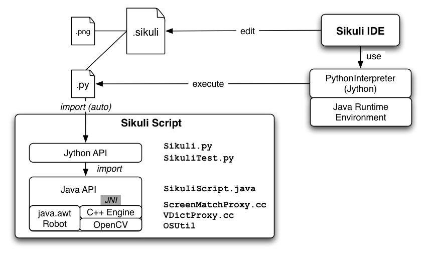

How Sikuli Works
=================

Sikuli Script
-------------
Sikuli Script is a Jython and Java library that automates GUI interaction using image patterns to direct keyboard/mouse events.
The core of Sikuli Script is a Java library that consists of two parts: java.awt.Robot, which delivers keyboard and mouse events to appropriate locations, and a C++ engine based on OpenCV, which searches given image patterns on the screen. The C++ engine is connected to Java via JNI and needs to be compiled for each platform.
On top of the Java library, a thin Jython layer is provided for end-users as a set of simple and clear commands. Therefore, it should be easy to add more thin layers for other languages running on JVM, e.g. JRuby, Scala, Javascript, etc.

The Structure of a Sikuli source/executable script (.sikuli, .skl)
------------------------------------------------------------------
A Sikuli script (.sikuli) is a directory that consists of a Python source file (.py), and all the image files (.png) used by the source file. All images used in a Sikuli script are simply a path to the .png file in the .sikuli bundle. Therefore, the Python source file can also be edited by any text editor.

While saving a script using Sikuli IDE, an extra HTML file is also created in the .sikuli directory so that users can share the scripts on the web easily.

A Sikuli executable script (.skl) is simply a zipped file of all files in the .sikuli directory. When a script is passed to Sikuli IDE as a command line argument, Sikuli IDE recognizes its type by check its filename extension. If a .skl is seen, Sikuli IDE runs it without showing the IDE window. If a .sikuli is seen, Sikuli IDE opens it in a source code editor.

Sikuli IDE
----------

Sikuli IDE edits and runs Sikuli source scripts. Sikuli IDE integrates screen capturing and a custom text editor (:samp:`SikuliPane`) to optimize the usability of writing a Sikuli script. To show embedded images in the :samp:`SikuliPane`, all string literals that ends with ".png" are replaced by a custom JButton object, :samp:`ImageButton`. If a user adjusts the image pattern's similarity, a Pattern() is automatically constructed on top of the image.

To execute a Sikuli script, Sikuli IDE creates a :samp:`org.python.util.PythonInterpreter` and automatically passes a few lines of headers (e.g. to import Sikuli's Jython modules, and to set the path to .sikuli directory) to the interpreter. Once these headers are set, the .py script is simply executed by :samp:`PythonInterpreter.execfile()`.

