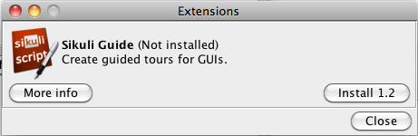

General Information
===================

.. _sikuliextensions:

.. versionadded:: X1.0-rc2

Extensions allow to implement new Sikuli features by adding packages to your current Sikuli installation. They are maintained at http://depot.sikuli.org/ by the developers of Sikuli (see **Technical Details** below). If you want to contribute a new extension or a modified exisiting one, please look at **How to contribute an extension** below.

How to Download and use an Extension
------------------------------------

The download of an extension is supported by the IDE through the menu **Tools** -> **Extensions**. You get a popup, that lists the available and already installed extensions and allows to download new packages or updates for installed ones.

This popup shows a new **package not yet installed**:

If you need more information about the features of the extension, just click **More Info** - this will open the related documentation from the web in a browser window.

If you want to install the extension, just click the **Install ...** button. The package will be downloaded and added to your extensions repository (see **Info** for details).

This popup shows an **installed package**:

.. image:: extension-installed.png

If a new version would be available at that time, the **Install ...** button would be active again, showing the new version number. Now you could click and download the new version.

**How to Use an Extension**

To use the features of an installed extension in one of your scripts, just say ``from extension-name import *``. For an usage example read :ref:`Sikuli Guide <sikuliguide>`.

For information about features, usage and API use menu **Tools** -> **Extensions** -> button **More Info** in the IDE.

Technical Details
-----------------

Extensions are Java jar-files containing some Java classes (usually the core functions) and at least one Python module, that defines the API to be used in a script.

Sikuli maintains a local extensions directory, where downloaded extensions are stored together with a hidden list of the installed extensions (Windows: , Mac: , Linux: ).

At time of usage ( ``from extension-name import *`` ) the Sikuli Import Manager makes the jar-file available in the current context using the :py:func:``load(path-to-jar-file)``.

The information about features, usage and API of an extension is available in this documentation (accessible via menu **Tools** -> **Extensions** -> button **More Info** in the IDE).

How to develop an extension
---------------------------

The **source structure** of an extension named ``extension-name`` looks like this: ::

	Java
	- org
	-- sikuli
	--- extension-name
	---- yourClass1.java
	---- yourClass2.java
	---- .... more classes
	python
	- extension-name
	-- __init__.py
	-- extension-name.py
	
The **final jar-structure** (filename ``extension-name-X.Y`` where X.Y is the version string) looks like this: ::
	
	org
	- sikuli
	-- extension-name
	--- yourClass1.class
	--- yourClass2.class
	--- .... more classes
	extension-name
	- __init__.py
	- extension-name.py
	META-INF
	- MANIFEST.MF

The file ``__init__.py`` contains at least ``from extension-name import *`` to avoid one qualification level. So in a script you might either use::

	import extension-name
	extension-name.functionXYZ()
	
or::

	from extension-name import *
	functionXYZ()
	
The second case requires more investement in a naming convention, that avoids naming conflicts.

The file ``extension-name.py`` contains the classes and methods, that represent the API, that one might use in a Sikuli script. 

As an example you may take the source of the extension Sikuli Guide.

How to test your extension
--------------------------

The final jar-file (during developement the filename has to be ``extension-name.jar`` without a version string) can be placed in the extensions directory, if it is a new one, with a name that is currently not present in this folder. Then saying ``import extension-name`` is sufficient.

If it is already there in the extensions directory, because you are developing a new version, you might put it in the same .sikuli folder as your test script. Then again saying ``import extension-name`` is sufficient, because of the internal search precedence.

The option that always works is to use the :py:func:`<load>` function with an absolute path to your ``extension-name.jar``, which is the first in the row. The load() function returns ``True``, if successful - otherwise False and puts ``absolute-path-to-your-extension-name.jar`` into ``sys.path``, so you can do your ``import extension-name`` afterwards.

How to contribute your extension
--------------------------------

Currently you have to contact the developers and agree on how to proceed.
