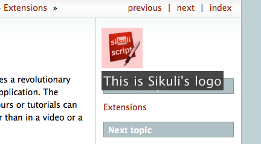
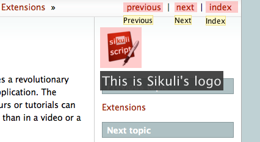
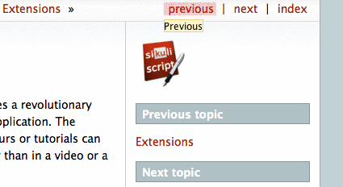
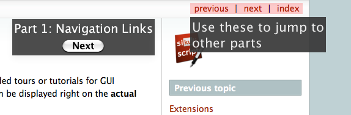
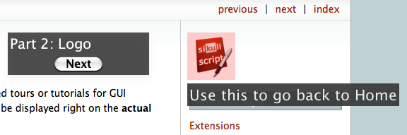
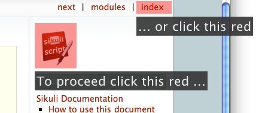

Sikuli Guide
============

.. _sikuliguide:

.. versionadded:: X1.0-rc2

Sikuli Guide is an extension to Sikuli that provides a revolutionary way to
create guided tours or tutorials for GUI applications. The revolutionary aspect
is that the content of the tours or tutorials can be displayed right on the
**actual interface**, rather than in a video or a series of screenshots on a
web page. All this can be combined with guided user activities directly in the  
respective GUI applications using all the other Sikuli features. 

Quick Start
^^^^^^^^^^^

First Example
-------------

In our first example, suppose we want to create a guided tour of this very documentation
page you are currently reading. We want to bring your attention to the logo
picture to the right. Using the functions provided by Sikuli Guide, we can
write the following script to accomplish this:

.. sikulicode::

	from guide import *
	text("sikuli-logo.png", "This is Sikuli's logo")
	show(5)

When you run this script, Sikuli Guide will search for the logo's image on the
screen, highlight it, and display the text ''This is Sikuli's logo'' below the
image, like the figure below: 

Again, this happens in the **actual interface**, rather than in a video or a
screenshot. The logo image that is highlighted is the actual interface element
users can click on.

Let's explain the script line by line. The first line is an ``import``
statement that tells Sikuli to load the Sikuli Guide extension. The secod line
uses the :py:func:`text(pattern, text) <guide.text>` function to add ``text``
next to a given ``pattern``, in this case, the logo image. Note that by default
the text added is not displayed immediately, it is only internally added 
to the visual element. In the third line, we call
:py:func:`show(secs) <guide.show>` to explicitly tell Sikuli Guide to now display 
all registerd annotation elements (in this case only the
text) for the duration specified by ``secs``. 

Below is a YouTube video of this example.

.. youtube:: ELNWxVjVb7Y?hd=1
      width:: 640
      height: 390

Adding Multiple Annotations
---------------------------

It is possible to add text or other annotations to multiple visual elements before
calling :py:func:`show(secs) <guide.show>` in order to show them on the screen at the same time.

.. sikulicode::

	from guide import *
	text("sikuli-logo.png", "This is Sikuli's logo")
	tooltip("previous.png","Previous")
	tooltip("next.png","Next")
	tooltip("index.png","Index")
	show(5)

The script above uses the function :py:func:`tooltip(text) <guide.tooltip>` to add tooltips to
three links in addition to the text annotation. The result of running this
script is shown below: 

Rather than showing the annotations all at once, we can also show them one by
one using separate ``show()`` statements. Below is an example where we cycle
through the three links and show the tooltip of each link one at a time.

.. sikulicode::

	from guide import *
	while True:
		tooltip("previous.png","Previous") 
		show(3) 
		tooltip("next.png","Next")
		show(3)
		tooltip("index.png","Index")
		show(3)

The result of running this script is shown below (3x speed-up):

Adding Interaction
------------------

Another way to control the flow of a guided tour is to display a dialog box
and let users click on a button to continue to the next part of the tour.
Sikuli Guide provides a function :py:func:`dialog(message) <guide.dialog>`
to accomplish this easily. Below is an example using this function to create a
two-part guided tour.

.. sikulicode::

	from guide import *
	text("links.png","Use these to jump to other parts")
	dialog("Part 1: Navigation Links")
        show()
	text("sikuli-logo.png","Use this to go back to Home")
	dialog("Part 2: Logo")
        show()

The tour presented by the script above introduces the navigation links above
and the Sikuli's logo as a shortcut to go back to the documentation's HOME
page. The function call ``dialog("Part 1")`` indicates the tour will show
a dialog that displays the message specified by the string argument 
(i.e., Part 1: Navigation Links). The following call to ``show()`` will
actually display the dialog along with the text elements spcified earlier.

The figure below shows what happens after Line 3:

After users click on the **Next** button, the tour moves to the next part. The
screen will look like below:

Making a Region clickable
-------------------------

You might use the feature :py:func:`clickable(PSRM) <guide.clickable>`, to make a region sensitive for clicks. 

.. sikulicode::

	from guide import *
	logo = find("sikuli-logo.png")
	text(logo, "To proceed click this red ...")
	clickable(logo)
	index = logo.above().right().find("index.png")
	text(index, "... or click this red")
	clickable(index)
	show()
	
The script waits until the user clicks one of the two highlighted areas.

.. py:module:: guide

Function References
^^^^^^^^^^^^^^^^^^^

**PSRM**: when used as a parameter, it can be either **P** a Pattern, 
**S** a string (image file name or just plain text), a **R** Region object
or **M** a Match object. With **PS** an implicit find operation takes place. 
(More information: :ref:`Finding inside a Region ... <FindinginsideaRegionandWaitingforaVisualEvent>`)

Static Annotations
------------------
	

.. py:function:: rectangle(PSRM)

	Add a rectangular overlay in red on the specified target's region.
	
	:param PSRM: a pattern, string, region or match 

.. py:function:: circle(PSRM)

	Add a red circle around the specified target's region.
	
	:param PSRM: a pattern, string, region or match 

.. py:function:: text(PSRM, text)

	Add some text (white large letters on dark grey background) left justified below the specified target's region, which is additionally highlighted.

	:param PSRM: a pattern, string, region or match 
	:param text: a string as text to display

.. py:function:: tooltip(PSRM, text)

	Add a tooltip (small text in a light yellow box) left justified below the specified target's region.

	:param PSRM: a pattern, string, region or match 
	:param text: a string as text to display

Interactive Elements
--------------------

.. py:function:: dialog(text)

      Add a dialog box displaying the given text in the middle of the screen above all othe windows.

      :param text: a string as text to display

.. py:function:: clickable(PSRM)

      Add a clickable element corresponding to the specified target's region. 

      :param PSRM: a pattern, string, region or match

Control
-------
	
.. py:function:: show([seconds])

	Show static and interactive components added so far for the specified amount of time. 

	:param seconds: a decimal number as display duration in seconds
	
	The default duration is 10 seconds. If interactive elements (either one or more clickable elements or 
	a dialog box) were previously added, it waits until the user interacts with one of these elements. 
	At this time all elements vanish and are discarded.

	**Note:** If a :py:func:`dialog` element is present, other interactive elements are visible, but not clickable. If the dialog element is clicked, all elements vanish and are discarded. 

