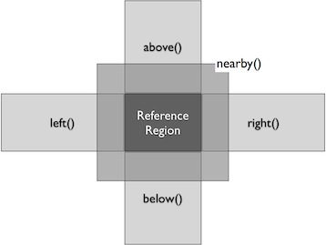

Region
======

Region is a rectangular section on a screen, which is defined by 
	1.	a location (x, y) of its upper left corner as a distance relative to the
		upper left corner of the screen (0, 0), and
	2.	its dimension (w, h) as its width and height. 

x, y, w, h are integer numbers counting a distance in pixels.

A region knows nothing about its visual content (windows, pictures, graphics,
text, ...). It only knows :ref:`the position on the screen and its dimension
<CreatingaRegionSettingandGettingAttributes>`.

New regions can be created, based on an existing region: you can :ref:`extend a
region in all directions or get the adjacent rectangle <ExtendingaRegion>` up
to the bounds of the screen horizontally or vertically. 

The visual content of a region is evaluated by using methods like
:py:meth:`Region.find`, which looks for a given rectangular pixel pattern
(defined by a :py:class:`Pattern` object) within the region.  The matching
content in the region has a similarity between 0 (not found) and 1 (found and
it is per pixel exactly matches to the pattern). The find can be advised, to
search with a minimum similarity, so that some minor variations in shape and
color can be ignored. If nothins else is specified, Sikuli searches with a
minimum similarity of 0.7, which does what is expected in general cases.

:ref:`Find operations <FindinginsideaRegionandWaitingforaVisualEvent>` return a
:py:class:`Match` object, which has all the attributes and methods as a region
has and can be used in exactly the same way (e.g. to find or click another
target within it). A :py:class:`Match` has the dimension of the pattern used
for searching and also knows the position where it was found and its similarity
score. A region preserves the best match of the last successful find operation
and all matches of the last successful :py:meth:`Region.findAll` (accessible
with :py:meth:`Region.getLastMatches` You can wait for patterns to show up
using :py:meth:`Region.wait`, to vanish using :py:meth:`Region.waitVanish` or
just check whether a pattern :py:meth:`Region.exists` without handling
[#ExceptionFindFailed exceptions]. 

Sikuli 0.10 begins to support visual event driven programming.  You can tell a
region to [#ObservingVisualEventsinaRegion observe that something appears,
vanishes, or changes]. It's possible to wait for the completion of an
observation or let it run in the background while your script is continuing.
When one of the visual events happens, a handler in your script is called. Each
region has one observer and each observer can handle multiple visual events.
It's your responsibility to stop an observation.

.. _CreatingaRegionSettingandGettingAttributes:

Creating a Region, Setting and Getting Attributes
-------------------------------------------------

In this chapter, you can find information on how to create a new region object.
Some of the attributes of a region object can be accessed directly or via a
method call. Here you will find the HowTo's. 

.. py:class:: Region

	.. py:method:: Region(x,y,w,h)
		Region(region)
		Region(Rectangle)

		Create a region object

		:param x: x position of a rectangle.
		:param y: y position of a rectangle.
		:param w: height of a rectangle.
		:param h: width of a rectangle.
		:param region: an existing region object.
		:param rectangle: an existing object of Java class Rectangle
		:return: a new region object.

		In addition to creating a region by using the tool provided
		by the IDE, a region can be created by specifying a rectangle. This is how
		the visual representation in the IDE of such a region is internally set up in
		the script.  A region can also be created by users in run-time using
		[#selectRegion selectRegion()].

		You can create a region by given another region. This just
		duplicates the region into a different and new object. This can be useful, if
		you need the same region with different attributes, such as
		[#ObservingVisualEventsinaRegion observation loop] or [#setThrowException
		whether throwing an exception when finding fails]. Another way to create a
		region is to specify a rectangle object or to [#ExtendingaRegion extend an
		existing region].

	.. py:method:: selectRegion([text])

		Select a region on the screen interactively 

		:param text: Text to display in the middle of the screen.
		:return: a new region object or None, if the user cancels the capturing process.

		In fact, :py:func:`selectRegion` is a method of [#ClassScreen Class Screen],
		but since it creates a region, it's mentioned here too.

		*text*  is displayed for about 2 seconds in the middle of the screen.
		If *text* is omitted, the default "Select a region on the screen" is
		displayed. 

		The interactive capture mode is entered and allows the user to select a
		region the same way as using the selection tool in the IDE. You may have to
		check the result, since the user may cancel the capturing.

	.. py:method:: setX(number)
		 setY(number)
		 setW(number)
		 setH(number)  

		Set the respective attribute of the region to the new value. This
		effectively moves the region around and/or changes its dimension.

		:param number: the new value

	.. py:method:: setROI(x,y,w,h)
		 setROI(rectangle)
		 setRect(x,y,w,h)
		 setRect(rectangle)

		Both methods are doing exactly the same: setting position and dimension to
		new values. The motivation for two names is to make scripts more readable:
		*setROI()* is intended to shrink a [#ClassScreen screen object] to speed up
		processing searches (region of interest), whereas *setRect()* should be
		used to redefine a region (which could be enlarging it). 

		:param x: the attributes of a rectangle
		:param rectangle: a rectangle object
		:return: None

	.. py:method:: getCenter()

		Get the center of the region.

		:return: an object of :py:class:`Location`

	.. py:method:: getScreen()

		Returns the screen object that contains this region. 
      
		:return: a new :py:class:`Screen` object
		  
		This method only makes sense in [#MultiMonitorEnvironments Multi
		Monitor Environments], since it always return the default screen in a
		single monitor
		environment.

	.. py:method:: getLastMatch()
			getLastMatches()

		:return: the best match as a :py:class:`Match` respectively one or more
			match objects as an :py:class`Iterator` object

		All successful find operations (explicit like [#find find()] or
		implicit like [#click click()]), store the best match into lastMatch
		of the region that was searched. findAll() store all found matches into
		lastMatches of the region that
		was searched as an iterator. 

		To access these attributes use '''region.getLastMatch()''' or
		'''region.getLastMatches()''' respectively.

		How to use the iterator object returned by getLastMatches()
		[#IteratingMatches is documented here].

	.. py:method:: setAutoWaitTimeout(seconds)

		Set the maximum waiting time for all subsequent find operations.
		
		:param seconds: a number, which can have a fraction. The internal
			granularity is milliseconds.

		This method enables all find operations to wait for the given
		pattern to appear until the specified amount of time has elapsed. The
		default is 3.0 seconds. This method is intended for users to override
		this default setting. As such it lets :py:meth:`Region.find` work like
		`Region.wait`, without being able to set an individual timeout value
		for a specific find operation.

	.. py:method:: getAutoWaitTimeout()

		Get the current value of the maximum waiting time for all subsequent
		find operations.
		
		:return: timeout in seconds

.. _ExtendingaRegion:

Extending a Region
------------------

These methods (exception inside()) return a new region object, that is
constructed based on the specified region (sometimes called spatial operators).
The range parameter, if given as positive integer number, restricts the
dimension of the new region (width and/or height respectively) based on that
value. If range  is not specified, the new region extends to the respective
boundary of the screen the given region belongs to. An exception is nearby(),
which uses 50 as its default range.

Note: In all cases the new region does not extend beyond any boundary of the
screen that contains the given region. 

.. py:class:: Region

	.. py:method:: inside()

		Derive a :py:class:`Region` object that represents the *inside* of the
		current region. This allows all subsequent searaches to be restricted
		to inside the region.

		:return: a :py:class:`Region` object

		This method can be used to make scripts more readable.
		region.inside().find() is totally equivalent to region.find()

	.. py:method:: nearby([range])

		Derive a new :py:class:`Region` that represents the nearby neighorhood
		of the the current region. The new region is derived by extending the
		current region in all directions by *range* number of pixels. The
		center of the new region remains hte same.

		:param range: a positive integer indicating the number of pixels (default = 50).
		:return: a :py:class:`Region` object

	.. py:method:: above([range])

		Derive a new :py:class:`Region` that represents the area *above* the
		current region. The new region is constructed by extending the current
		region from its top border by *range* number of pixels towards the top
		boundary of the screen. This new region will also include the current
		region. If *range* is omitted, it extends all the way to the boudnary
		of the screen. The new region has the same width and x-position as the
		current region.

		:param range: a positive integer indicating the number of pixels to
			extend above.

	.. py:method:: below([range])

		Derive a new :py:class:`Region` that represents the area *below* the
		current region. The new region is constructed by extending the current
		region from its bottom border by *range* number of pixels towards the
		bottom boundary of the screen. The new region will also include the
		current region. If *range* is omitted, it extends all the way to the
		bottom boundary of the sreen. The new region has the same width and
		x-position as the current region.

	.. py:method:: left([range])

		Derive a new :py:class:`Region` that represents the area to the *left*
		of the current region. The new region is constructed by extending the
		current region from its left border by *range* number of pixels towards
		the left boundary of the screen. The new region will also include the
		current region. If *range* is omitted, it extends all the way to the
		left boundary of the sreen. The new region has the same height and
		y-position as the current region.

	.. py:method:: right([range])

		Derive a new :py:class:`Region` that represents the area to the *right* of the
		current region. The new region is constructed by extending the current
		region from its right border by *range* number of pixels towards the
		right boundary of the screen. The new region will also include the
		current region. If *range* is omitted, it extends all the way to the
		right boundary of the sreen. The new region has the same height and
		y-position as the current region.

.. _FindinginsideaRegionandWaitingforaVisualEvent:

Finding inside a Region and Waiting for a Visual Event
------------------------------------------------------

In addition to acting on visual objects, finding them is also one of the core
functions of Sikuli. As a default, if the visual object cannot be found, Sikuli
will stop the script by raising an exception FindFailed. This follows the
standards of the Python language so that you can handle such exceptions using
try ... except. If you are not used to programming and just want to bypass the
exception handling, you can read this section about exception FindFailed.

**PS**: means, that either a :py:class:`Pattern` or a string (path to an image
file or just plain text) can be used as parameter. A find operation is
successful, if the given image is found with the given minimum similarity or
the given text is found exactly. Similarity is a value between 0 and 1 to
specify how likely the given image looks like the target. By default, the
similarity is 0.7 if an image rather than a pattern object with a specific
similarity is given to :py:meth:`Region.find()`.

If a find operation is successful, the returned match is additionally stored
internally with the region that was used for the search. So instead of using a
variable to store the match (m = find()), you can use getLastMatch() to access
it afterwards. Unsuccessful find operations will leave these values unchanged.
(This only happens when using exists(), exception handling or when running with
setThrowException(''False'')).

Normally all these region methods are used as reg.find(PS), where reg is a
region object. If written as find(PS) it acts on the default screen, which is
an implicit region in this case. But sometimes it's a good idea to use
region.find() to restrict the search to a smaller region in order to speed up
processing.

If you have multiple monitors, please read Multi Monitor Environments.

Note on IDE: Capturing is a tool in the IDE, to quickly set up images to search
for. These images are named automatically by the IDE and stored together with
the script, at the time it is saved (we call the location in the file system
bundle-path). Behind the curtain, the images itself are specified simply by
using a string containing the file name (path to an image file). 

.. py:class:: Region

	.. py:method:: find(PS)

		:param PS: a :py:class:`Pattern` object or a string (path to an image file or just plain text)

		:return: a :py:class:`Match` object that contains the best match. In
			case thtat exception handling for :py:class:`FindFailed` is switched
			off by :py:func:setThrowException, *None* is returned if nothing is
			found. (Note: By default, the exception handling of
			:py:class:`FindFailed` is turned on).

		Find a particular GUI element, which is seen as the given image or
		text. The given file name of an image specifies the element's
		appearance. It searches within the region and returns the best match,
		which shows a similarity greater than the minimum similarity given by
		the pattern. If no similarity was set for the pattern by
		:py:meth:`Pattern.similar` before, a default minimum similarity of 0.7
		is set automatically. If no match is found with the minimum similarity
		or greater, the find fails (raises exception :py:class:`FindFailed` or
		returns None).

		If autoWaitTimeout is set to a non-zero value, find() just acts as a wait().

		**Side Effects**

		1.	*FindFailed*: If the find fails (no match, whose similarity is equal or
			greater than the minimum similarity of the pattern, can be found) and
			exception handling is turned on (which is the the default), an
			exception FindFailed is raised. If the script does not handle the
			exception, the script is stopped, with a message about the exception. 

		2.	*lastMatch*: the best match can be accessed using
			:py:meth:`Region.getLastMatch` afterwards.

	.. py:method:: findAll(PS)

		Repeatedly find ALL the instances of a pattern, until no match can be
		found anymore, that meets the requirements for a single
		:py:meth:`Region.find()` with the specified pattern.

		:param PS: a :py:class:`Pattern` object or a string (path to an image
			file or just plain text)

		:return: one ore more match objects as an iterator object. How to
			iterate through is documented here. In case that exception handling for
			FindFailed is switched off by :py:func:`setThrowException` *None* is
			returned, if nothing is found. (Note: By default at script start
			exception handling of FindFailed is turned on). 

		**Side Effects**

		1. 	*FindFailed*: If the find fails (no match can be found, whose similarity
			is equal or greater than the minimum similarity of the pattern) and
			exception handling is turned on (which is the default) an exception
			FindFailed is raised. If the script does not handle the exception, the
			script is stopped, with a message about the exception.
			
		2.	*lastMatches*: a reference to the returned iterator object containing the
			found matches is stored with the region that was searched. It can be
			accessed using getLastMatches() afterwards. How to iterate through an
			iterator of matches is documented here.

	.. py:method:: wait([PS],[seconds])

		:param PS: a :py:class:`Pattern` object or a string (path to an image
			file or just plain text)
		:param seconds: a number, which can have a fraction, as maximum waiting
			time in seconds. The internal granularity is milliseconds. If not
			specified, the auto wait timeout value set by
			:py:meth:`Region.setAutoWaitTimeout` is used. Use the constant
			*FOREVER* to wait for an infinite time. 

		If *PS* is not specified, the script just pauses for the specified
		amount of time. ( it's still possible to use sleep( seconds ) instead,
		but this is deprecated. )

		If *PS* is specified, it keeps searching the given pattern in the
		region until the image appears ( would have been found with
		:py:meth:`Region.find`) or the specified amount of time has elapsed. At
		least one find operation is performed, even if 0 seconds is specified.) 

	.. py:method:: waitVanish(PS, [seconds])

		Wait until the give pattern *PS* in the region vanishes.

		:param PS: a :py:class:`Pattern` object or a string (path to an image
			file or just plain text)
		:param seconds: a number, which can have a fraction, as maximum waiting
			time in seconds. The internal granularity is milliseconds. If not
			specified, the auto wait timeout value set by
			:py:meth:`Region.setAutoWaitTimeout` is used. Use the constant
			*FOREVER* to wait for an infinite time.

		:return: *True* if the pattern vanishes within the specified waiting
			time, or *False* if the pattern stays visible after the waiting time
			has elapsed.

		This method keeps searching the given pattern in the region until the
		image vanishes (can not be found with :py:meth:`Region.find` any
		longer) or the specified amount of time has elapsed. At least one find
		operation is performed, even if 0 seconds is specified. 

		Note: You may adjust the scan rate (how often a search during the wait
		takes place) by setting Settings.WaitScanRate appropriately. 

	.. py:method:: exists(PS, [seconds])

		Check whether the give pattern is visible on the screen.

		:param PS: a :py:class:`Pattern` object or a string (path to an image
			file or just plain text)
		
		:param seconds: a number, which can have a fraction, as maximum waiting
			time in seconds. The internal granularity is milliseconds. If not
			specified, the auto wait timeout value set by
			:py:meth:`Region.setAutoWaitTimeout` is used. Use the constant
			*FOREVER* to wait for an infinite time.

		:return: a :py:class:`Match` object that contains the best match. None
			is returned, if nothing is found within the specified waiting time

		Does exactly the same as :py:meth:`Region.wait()`, but no exception is
		raised in case of FindFailed. So it can be used to symplify scripting
		in case that you only want to know wether something is there or not to
		decide how to proceed in your workflow. So it is typically used with an
		if statement.  At least one find operation is performed, even if 0
		seconds is specified. So specifying 0 seconds saves some time, in case
		there is no need to wait, since its your intention to get the
		information "not found" directly. 

Observing Visual Events in a Region
-----------------------------------

This feature allows to some extent the implementation of visual event driven
programming.

You can tell a region to observe that something appears or vanishes or the
content changes at all. Using the methods onAppear(), onVanish() and
onChange(), you register an event observer that starts its observation when you
call observe(). Each region object can have exactly one observation active and
running. For each observation, you can register as many event observers as
needed. So you can think of it as grouping some wait() and waitVanish()
together and have them processed simultanouesly, while you are waiting for one
of these events to happen.

It's possible to let the script wait for the completion of an observation or
let it run in the background, while your script is continuing. With a timing
parameter you can tell observe() to stop observation anyway after the given
time.

When one of the visual events happens, an event handler written by you is
called. An event handler is a function contained in your script and expects an
event object as a parameter. During the processing in your handler, the
observation is paused until your handler has ended. Information between the
main script and your handlers can be given forward and backward using global
variables.

It's your responsibility to stop an observation. This can either be done by
calling region.stopObserver() or by starting observe() with a timing parameter.

Since you can have as many region objects as needed and each region can have
one observation active and running. So theoretically it's possible to have as
many visual events being observered at the same time as needed. But in reality,
the number of observation is still limited by the system resources available to
Sikuli at that time.

Be aware, that every observation is a number of different find operations that
are processed repeatedly. So to speed up processing and keep your script
acting, you may want to define a region for observation as small as possible.
You may adjust the scan rate (how often a search during the observation takes
place) by setting Settings.ObserveScanRate appropriately. 

PS: means, that either a Pattern or a String (path to an image file or just
plain text) can be used as parameter.

handler: as a parameter in the following methods, you have to specify the name
of a function, which will be called by the observer, in case the observed event
happens. The function itself has to be defined in your script before using the
method that references the function. The existance of the function will be
checked before starting the script. So to get your script running, you have to
have at least the following statements in your script::

	def myHandler(event): # you can choose any valid function name
		# event: can be any variable name, it references an event object
		pass # add your statements here

	onAppear("path-to-an-image-file", myHandler) # or any other onEvent()
	observe(10) # observes for 10 seconds

Normally all the region methods are used as reg.onAppear(PS), where reg is a
region object. If written as onAppear(PS) the different repeatedly performed
implicit find operations operate on the default screen  being the implicit
region in this case. But using region.onEvent() will restrict the search to the
region's rectangle and speed up processing, if region is significantly smaller
than the whole screen.

Note: In case of having more than one Monitor active, read Multi Monitor
Environments before.

Note on IDE: Capturing is a tool in the IDE, to quickly set up images to search
for. These images are named automatically by the IDE and stored together with
the script, at the time it is saved (we call the location in the file system
bundle-path). Behind the curtain the images itself are specified by using a
string containing the file name (path to an image file).

.. py:class:: Region

	.. py:method:: onAppear(PS, handler)

		:param PS: a :py:class:`Pattern` object or a string (path to an image
			file or just plain text.

		:param handler: the name of a handler function in the script

		With the given region you register an observer, that should wait for
		the pattern to be there or to appaear and is activated with the next
		call of observe(). In the moment the internal find operation on the
		given pattern is successful during observation, your handler is called
		and the observation is paused until you return from your handler. 

	.. py:method:: onVanish(PS, handler)

		:param PS: a :py:class:`Pattern` object or a string (path to an image
			file or just plain text.

		:param handler: the name of a handler function in the script

		With the given region you register an observer, that should wait for
		the pattern to be not there or to vanish and is activated with the next
		call of observe(). In the moment the internal find operation on the
		given pattern fails during observation, your handler is called and the
		observation is paused until you return from your handler. 

	.. py:method:: onChange(handler)

		:param handler: the name of a handler function in the script
		
		With the given region you register an observer, that should wait for
		the visual content of the given region to change and is activated with
		the next call of observe(). In the moment the visual content changes
		during observation, your handler is called and the observation is
		paused until you return from your handler. 

	.. py:method:: observe([seconds], [background = False | True])

		Begin observation within the region.

		:param seconds: a number, which can have a fraction, as maximum
			observation time in seconds. Omit it or use the constant FOREVER to
			tell the observation to run for an infinite time (or until stopped
			by a call of stopObserve()). 
		
		:param background: a flag indicating whether observation is run in the
			background. when set to *True*, the observation will be run in the
			background and processing of your script is continued immediately.
			Otherwise the script is paused until the completion of the
			observation.

		For each region object, only one observation can be running at a given time.

		Note: You may adjust the scan rate (how often a search during the
		observation takes place) by setting :py:attr:`Settings.ObserveScanRate`
		appropriately. 
		
	.. py:method:: stopObserver()

		Stop observation within the region.

		This must be called on a valid region object. The source region of an
		observed visual event is available as one of the attributes of the *event*
		parameter that is passed to the handler function when the function is
		invoked. For example, to stop observation within a handler function, simply
		call ``event.region.stopObserver()`` inside the handler function.

Acting on a Region
------------------

Besides finding visual objects on the screen, acting on these elements is one of the
kernel operations of Sikuli. Mouse actions can be simulated as well as pressing keys
on a keyboard.

The place on the screen, that should be acted on (in the end just one specific
pixel, the click point), can be given either as a pattern PS like with the find
operations or by directly referencing a pixel as center of a region object (match or
screen also), the target pixel connected with a match or a pixel location. Since all
these choices can be used with all action methods as needed, they are abbreviated
and called like this:

**PSMRL:** which means, that either a :py:class:`Pattern` object or a string (path to an image file or just
plain text) or a :py:class:`Match` or a :py:class:`Region` or a :py:class:`Location` can be used as parameter, in
detail: 

*	P: *pattern*: a :py:class:`Pattern` object. An implicit find operation is
	processed first. If successful, the center of the resulting matches rectangle is
	the click point. If the pattern object has a target offset specified, this is
	used as click point instead. 

*	S: *string*: a path to an image file or just plain text. An implicit find
	operation with the default minimum similarity 0.7 is processed first. If
	successful, the center of the resulting match object is the click point. 

*	M: *match:* a match object from a previous find operation. If the match has a target
	specified it is used as the click point, otherwise the center of the matches
	rectangle. 

*	R: *region:* a region object whose center is used as click point. 

*	L: *location:* a location object which by definition represents a point on the
	screen that is used as click point. 

ers It is possible to press the so called key modifiers together with the mouse
operation or when simulating keyboard typing. The respective parameter is given by
one or more predefined constants. If more than one modifier is necessary, they are
combined by using "+" or "|".

Be aware: when using PS as parameter, internally there has to be processed an
implicit find operation before, so the aspects of :ref:`find operations
<FindinginsideaRegionandWaitingforaVisualEvent>` and of :py:meth:`Region.find`
apply. If the find operation was successful, the match that was acted on, can be
recalled using :py:meth:`Region.getLastMatch`. Especially remember the fact, that as
a default, Sikuli will stop the script, if the visual object cannot be found, by
raising an exception FindFailed. This is done according to the standards of the
Python language, which allows you to handle such exceptions. If you are not really
used to programming and do not have a good knowledge of Python, it may be helpful,
to first read about exception FindFailed.

Normally all these region methods are used as ``reg.click(PS)``, where reg is a
region object. If written as ``click(PS)`` the implicit find is done on the default
screen being the implicit region in this case. But using ``reg.click(PS)`` will
restrict the search to the region's rectangle and speed up processing, if region is
significantly smaller than the whole screen.

Note on IDE: Capturing is a tool in the IDE, to quickly set up images to search for.
These images are named automatically by the IDE and stored together with the script,
at the time it is saved (we call the location in the file system bundle-path).
Behind the curtain the images itself are specified by using a string containing the
file name (path to an image file).

Note: If you need to implement more sophisticated mouse and keyboard actions look at
Low Level Mouse and Keyboard Actions.

Note: In case of having more than one Monitor active, refer to :ref:`Multi Monitor
Environments <MultimonitorEnvironments>` for more details.

Note on Mac: it might be necessary, to use :py:func:`switchApp` before, to prepare the
application for accepting the action.

.. py:class:: Region

	.. py:method:: click(PSMRL, [modifiers])

		Perform a mouse click on the click point using the left button.
		
		:param PSMRL: a pattern, a string, a match, a region or a location that
			evaluates to a click point.

		:param modifiers: one or more key modifiers

		:return: the number of performed clicks (actually 1). A 0 (integer null)
			means that because of some reason, no click could be performed. This
			would be the case, if using *PS* (yields an implicit find), the find fails
			and you have switched of exception FindFailed to be raised. Otherwise
			the script is stopped with a FindFailed exception.

		**Sideeffects**: when using *PS*, the match can be accessed using
		:py:meth:`Region.getLastMatch` afterwards.

	.. py:method:: doubleClick(PSMRL, [modifiers])

		Perform a mouse double-click on the click point using the left button.
		
		:param PSMRL: a pattern, a string, a match, a region or a location that
			evaluates to a click point.

		:param modifiers: one or more key modifiers

		:return: the number of performed double-clicks (actually 1). A 0 (integer null)
			means that because of some reason, no click could be performed. This
			would be the case, if using *PS* (yields an implicit find), the find fails
			and you have switched of exception FindFailed to be raised. Otherwise
			the script is stopped with a FindFailed exception.

		**Sideeffects**: when using *PS*, the match can be accessed using
		:py:meth:`Region.getLastMatch` afterwards.

	.. py:method:: rightClick(PSMRL, [modifiers])

		Perform a mouse click on the click point using the right button.

		:param PSMRL: a pattern, a string, a match, a region or a location that
			evaluates to a click point.

		:param modifiers: one or more key modifiers

		:return: the number of performed right cilicks (actually 1). A 0 (integer null)
			means that because of some reason, no click could be performed. This
			would be the case, if using *PS* (yields an implicit find), the find fails
			and you have switched of exception FindFailed to be raised. Otherwise
			the script is stopped with a FindFailed exception.

		**Sideeffects**: when using *PS*, the match can be accessed using
		:py:meth:`Region.getLastMatch` afterwards.

	.. py:method:: highlight([seconds])

		Highlight the region for some period of time.

		:param seconds: a decimal number taken as duration in seconds

		The region is highlighted showing a red colored frame around it. If the
		parameter seconds  is given, the script is suspended for the specified time.
		If no time is given, the highlighting is started and the script continues.
		When later on the same highlight call without a parameter is made, the
		highlighting is stopped (behaves like a toggling switch). 

		Example::

			m = find(some_image)

			# the red frame will blink for about 7 - 8 seconds
			for i in range(5):
				m.highlight(1)
				wait(0.5)

			# a second red frame will blink as an overlay to the first one
			m.highlight()
			for i in range(5):
				m.highlight(1)
				wait(0.5)
			m.highlight()

			# the red frame will grow 5 times
			for i in range(5):
				m.highlight(1)
				m = m.nearby(20)

		The red frame is just an overlay in front of all other screen content and
		stays in its place, independently from the behavior of this other content,
		which means it is not "connected" to the defining region. 

	.. py:method:: hover(PSMRL)

		Move the mouse cursor to hover above a click point.

		:param PSMRL: a pattern, a string, a match, a region or a location that
			evaluates to a click point.

		:param modifiers: one or more key modifiers

		:return: the number 1 if the mousepointer could be moved to the click point.
			If using *PS*  (yields an implicit find), the find fails and you have
			switched of exception FindFailed to be raised, a 0 (integer null) is
			returned.  Otherwise the script is stopped with a FindFailed exception.

		**Sideeffects**: when using *PS*, the match can be accessed using
		:py:meth:`Region.getLastMatch` afterwards.

	.. py:method:: dragDrop(PSMRL, PSMRL, [modifiers])

		Perform a drag-and-drop operation from a starting click point to the target
		click point indicated by the two PSMRLs respectively.

		:param PSMRL: a pattern, a string, a match, a region or a location that
			evaluates to a click point.

		:param modifiers: one or more key modifiers

		**Sideeffects**: when using *PS*, the match of the target can be accessed using
		:py:meth:`Region.getLastMatch` afterwards. If only the first parameter is
		given as *PS*, this match is returned by :py:meth:`Region.getLastMatch`.

		When the operation does not perform as expected (usually caused by timing
		problems due to delayed reactions of applications), you may adjust the
		internal timing parameters :py:attr:`Settings.DelayAfterDrag` and
		:py:attr:`Settings.DelayBeforeDrop` eventually combined with the internal
		timing parameter :py:attr:`Settings.MoveMouseDelay`.

		Another solution might be, to use a combination of :py:meth:`Region.drag`
		and :py:meth:`Region.dropAt` combined with your own wait()'s.  If the mouse
		movement from source to target is the problem, you might break up the move
		path into short steps using :py:meth:`Region.mouseMove`. 

		Note: If you need to implement more sophisticated mouse and keyboard actions
		look at Low Level Mouse and Keyboard Actions. 

	.. py:method:: drag(PSMRL)

		Start a drag-and-drop operation by dragging at the given click point.

		:param PSMRL: a pattern, a string, a match, a region or a location that
			evaluates to a click point.

		:param modifiers: one or more key modifiers

		:return: the number 1 if the operation could be performed. If using *PS*
			(yields an implicit find), the find fails and you have switched of
			exception FindFailed to be raised, a 0 (integer null) is returned.
			Otherwise the script is stopped with a FindFailed exception.
			
		The mousepointer is moved to the click point and the left mouse button is
		pressed and held, until another mouse action is performed (e.g. a
		:py:meth:`Region.dropAt()`	afterwards). This is nomally used to start a
		drag-and-drop operation.

		**Sideeffects**: when using *PS*, the match can be accessed using
		:py:meth:`Region.getLastMatch` afterwards.

	.. py:method:: dropAt(PSMRL, [delay])

		Complete a drag-and-drop operation by dropping a previously dragged item at
		the given target click point.

		:param PSMRL: a pattern, a string, a match, a region or a location that
			evaluates to a click point.

		:param modifiers: one or more key modifiers

		:return: the number 1 if the operation could be performed. If using *PS*
			(yields an implicit find), the find fails and you have switched of
			exception FindFailed to be raised, a 0 (integer null) is returned.
			Otherwise the script is stopped with a FindFailed exception.

		The mousepointer is moved to the click point. After waiting for delay
		seconds the left mouse button is released. This is normally used to finalize
		a drag-and-drop operation. If it is necessary to visit one ore more click
		points after dragging and before dropping, you can use
		:py:meth:`Region.mouseMove` inbetween.

		**Sideeffects**: when using *PS*, the match can be accessed using
		:py:meth:`Region.getLastMatch` afterwards.

	.. py:method:: type([PSMRL], text, [modifiers])

		Type the text at the current focused input field or at a click point
		specified by *PSMRL*.

		:param PSMRL: a pattern, a string, a match, a region or a location that
			evaluates to a click point.

		:param modifiers: one or more key modifiers

		This method simulates keyboard typing interpreting the characters of text
		based on the layout/keymap of the standard US keyboard (QWERTY). Special
		keys (ENTER, TAB, BACKSPACE, ...) can be incorporated into text by using the
		constants defined in class Key using the standard string concatenation (+).
		
		If *PSMRL* is given, a click on the clickpoint is performed before typing, to
		gain the focus. (Mac: it my be necessary, to use :py:func:`switchApp` before
		in order for a target application to obtain the input focus to accept typed
		characters.)

		If *PSMRL* is omitted, it performs the typing on the current focused visual
		component (normally an input field or an menu entry that can be selected by
		typing something). returns: the number 1 if the operation could be
		performed, otherwise 0 (integer null). If using *PS*  (yields an implicit
		find), the find fails and you have switched of exception FindFailed to be
		raised, a 0 (integer null) is returned. Otherwise the script is stopped with
		a FindFailed exception. 

		**Sideeffects**: when using *PS*, the match can be accessed using
		:py:meth:`Region.getLastMatch` afterwards.

		Note: If you need to type international characters or you are using
		layouts/keymaps other than US-QWERTY, you should use :py:meth:`Region.paste`
		insteda. Since type() is rather slow because it simulates each key press,
		for longer text it is preferrable to use :py:meth:`Region.paste`.

	.. py:method:: paste([PSMRL], text)

		Paste the text at a click point.		

		:param PSMRL: a pattern, a string, a match, a region or a location that
			evaluates to a click point.

		:param modifiers: one or more key modifiers

		:returns: the number 1 if the operation could be performed, otherwise 0
			(integer null). If using PS (yields an implicit find), the find fails
			and you have switched of exception FindFailed to be raised, a 0 (integer
			null) is returned. Otherwise the script is stopped with a FindFailed
			exception.

		Pastes text using the clipboard with OS-level shortcut (Ctrl-V or Cmd-V). So
		afterwards your clipboard contains text. paste() is a temporary solution for
		typing international characters or typing on keyboard layouts other than
		US-QWERTY.

		If *PSMRL* is given, a click on the clickpoint is performed before typing, to
		gain the focus. (Mac: it my be necessary, to use :py:func:`switchApp` before
		in order for a target application to obtain the input focus to accept typed
		characters.)

		If *PSMRL* is omitted, it performs the paste on the current focused component
		(normally an input field).

		**Sideeffects**: when using *PS*, the match can be accessed using
		:py:meth:`Region.getLastMatch` afterwards

		NOTE: Special keys (ENTER, TAB, BACKSPACE, ...) cannot be used with paste().
		If needed, you have to split your complete text into two or more paste()'s
		and use type() for typing the special keys inbetween. Characters like \n
		(enter/new line) and \t (tab) should work as expected with paste(). 

