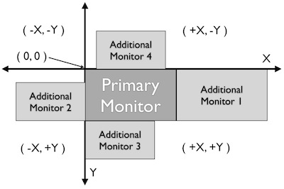

Screen
======

.. py:class:: Screen

Class Screen is there, to have a representation for a pysical monitor where the
capturing process (grabbing a rectangle from a screenshot, to be used for further
processing with find operations is implemented. For :ref:`Multi Monitor Environments
<MultimonitorEnvironments>` it contains features to map to the relevant monitor.

Since Screen extends class :py:class:`Region`, all methods of 
class Region can be used with a screen object.

Of special interest might be the grouping of region method calls using ``with:`` in Multi Monitor
Environments: use it for other screens, than the default/primary screen, where
you have this feature by default. 

Be aware, that using the whole screen for find
operations may have an impact on performance. So if possible either use ``setROI()`` or
restrict a find operation to a smaller region object (e.g. ``reg.find()``) to speed up
processing.

Screen: Setting, Getting Attributes and Information
---------------------------------------------------

.. py:class:: Screen

	.. py:method:: Screen([id])

		Create a new Screen object

		:param id: an integer number indicating which monitor in a multi-monitor
			environment.

		:return: a new screen object.

		It creates a new screen object, that represents the default/primary monitor
		(whose id is 0), if id is omitted. Numbers 1 and higher represent additional
		monitors that are available at the time, the script is running (read for
		details).

		Using numbers, that do not represent an existing monitor, will stop the
		script with an error. So you may either use getNumberScreens() or exception
		handling, to avoid this.

		Note: If you want to access the default/primary monitor ( Screen(0) )
		without creating a new screen object, use the constant reference SCREEN,
		that is initiated when your script starts: SCREEN=Screen(0). 

	.. py:method:: getNumberScreens()

		Get the number of screens in a multi-monitor environment at the time the
		script is running

	.. py:method:: getBounds()

		Get the dimensions of monitor represented by the screen object.

		:return: a rectangle object

		The width and height of the rectangle denote the dimensions of the monitor
		represented by the screen object. These attributes are obtained from the
		operating system. They can not be modified using Sikuli script.

.. _DefaultScreen:

Screen as (Default) Region
--------------------------

Normally all region methods are used as reg.find(PS), where reg is a region object
(or a screen or a match object). If written as find(PS) it acts on the default
screen being the implicit region in this case (mapped to the constant reference
SCREEN). In Multi Monitor Environments  this is the primary monitor (use the
constant reference SCREEN, to access it all the time), that normally is Screen(0),
but might be another Screen() object depending on your platform.

So its a convenience feature, that can be seen as an implicit use of the python
construct '''with object:'''.

On the other hand this may slow down processing speed, because of time consuming
searches. So to speed up processing, saying region.find() will restrict the search
to the specified rectangle. Another possibility is to say setROI() to restrict the
search for all following find operations to a smaller region than the whole screen.
This will speed up processing, if the region is significantly smaller than the whole
screen.

Capturing
---------

Capturing is the feature, that allows to grab a rectangle from a screenshot, to save
it for later use. At each time, a capturing is initiated, a new screenshot is taken.

There are two different versions: the first one :py:meth:`Screen.capture` saves the
content of the selected rectangle in a file and returns its file name, whereas the
second one :py:meth:`Screen.selectRegion` just returns the position and dimension of
the selected rectangle.

Both features are available in the IDE via the buttons in the toolbar. 

.. py:class:: Screen

	.. py:method:: capture([region | rectangle | text])
			capture(x,y,w,h)

		:param region: an existing region object.
		:param rectangle: an existing rectangle object (e.g., as a return value of
			another region method).	
		:param text: text to display in the middle of the screen in the interactive
			mode.
		:param x: x position of the rectangle to capture
		:param y: y position of the rectangle to capture
		:param w: width of the rectangle to capture
		:param h: height of the rectangle to capture

		:return: the path to the file, where the captured image was saved. In
			interactive mode, the user may cancel the capturing, in which case
			*None* is returned.

		**Interactive Mode:** The script enters the screen-capture mode like when
		clicking the button in the IDE, enabling the user to capture a rectangle on
		the screen. If no *text* is given, the default "Select a region on the screen"
		is displayed. 

		If any arguments other than text are specified, capture() automatically
		captures the given rectangle of the screen. In any case, a new screenshot is
		taken, the content of the selected rectangle is saved in a temporary file.
		The file name is returned and can be used later in the script as a reference
		to this image. It can be used directly in cases, where a parameter PS is
		allowed (e.g. :py:meth:`Region.find`, :py:meth:`Region.click`, ...). 

	.. py:method:: selectRegion([text])

		Select a region on the screen interactively 

		:param text: Text to display in the middle of the screen.
		:return: a new :py:class:`Region` object or None, if the user cancels the capturing process.
		
		**text**  is displayed for about 2 seconds in the middle of the screen.
		If **text** is omitted, the default "Select a region on the screen" is
		displayed. 

		The interactive capture mode is entered and allows the user to select a
		region the same way as using the selection tool in the IDE. 
		
		**Note:** You should check the result, since the user may cancel the capturing.

.. _MultimonitorEnvironments:

Multi-Monitor Environments
--------------------------

If more than one monitor is available, Sikuli is able to manage regions and click
points on these monitors.

The base is the coordinate system (picture above), that positions the primary
monitor with its upper left corner at (0,0) extending the x-direction to the right
and the y-direction towards the lower boundary of the screen. The position of
additional monitors can be configured in the operating system to be on either side
of the primary monitor, with different positions and sizes. So monitors left of the
primary will have pixels with negative x-values and monitors above will have
negative y-values (left and above both x and y are negative).

At script start, Sikuli gets the relevant information from the operating system and
creates respective screen objects, that have an ID (0 for the first or primary
monitor, 1 and higher for additional monitors with a maximum of one less than the
number of screens) and know the rectangle, they cover in the coordinate system.
These informations are readonly for a script.

These predefined screen objects can be accessed with Screen(0), Screen(1), ... and
are normally used to create your own screen objects. The possibility to use the
region methods on a default region mapped to the primary monitor is implemented with
the constant reference SCREEN. This concept is only available for the primary
monitor. 

How to get the relevant information:

*	:py:func:`getNumberScreens() <Screen.getNumberScreens>` returns the number of available screens.
*	:py:func:`getBounds() <Screen.getBounds>` returns the rectangle covered by the default/primary
	monitor.
*	:py:meth:`Screen.getBounds` returns the rectangle covered by a screen object
	created using :py:meth:`Screen(id) <Screen.Screen>`.

Be aware: Changes in your system settings are only recognized by the IDE, when it is
started.

**Windows:** The monitor, that is the first one based on hardware mapping (e.g. the
laptop monitor), will always be Screen(0). In the Windows settings it is possible to
place the taskbar on one of the secondary monitors, which makes it the primary
monitor getting the base coordinates (0,0). The other available monitors are mapped
around based on your settings. But the Sikuli internal mapping is not changed, so the primary
monitor might be any of your Screen() objects. Sikuli takes care for that and maps
SCREEN always to the primary monitor (the one with the (0,0) coordinates).
So for example you have a laptop with an external monitor, that shows the taskbar
(is primary monitor):

* SCREEN maps to Screen(1)
* Screen(0) is your laptop monitor 

**Mac:** The monitor, that has the System Menu Bar, is always Screen(0) and mapped
to the default SCREEN. 

**Linux** (Under construction)
	
With its rectangle, a screen object is always identical with the monitor
it was created using :py:meth:`Screen(id) <Screen.Screen>`. Using :py:meth:`Region.setROI` to restrict
the region of interest for find operations has no effect on the base rectangle of
the screen object.

On the other hand region objects and location objects can be positioned anywhere in
the coordinate system. Only when a find operation or a click action has to be
performed, the objects rectangle or point has to be inside the rectangle of an
existing monitor (basically repersented by Screen(0), Screen(1), ...). When
this condition is met, everything works as expected and known from a single monitor
system.

With finding and acting there are the following exceptions: 

*	**Point Outside:** a click point is outside any monitor rectangle. The
	clickpoint will be mapped to the edges or corners of the primary monitor
	according to the relative position:

	*	to the edges if its x or y value is in the range of the respective edge
		(right, left, above, below)i
	*	to the corners, if x and y are outside any range of any edge (left/above ->
		upper left corner, ...)

*	**Region Outside:** a region is completely outside any monitor

	*	a click action is handled in thesame way as **Point Outside**
	*	a find operation will always fail

*	**Region Partially Outside:** a region is partially outside a monitor but
	not overlapping another monitor

	*	a click action is handled in the same way as **Point Outside**
	*	a find operation will be carried out only in the part of region within the
		bounds of the monitor, excluding the area outside the monitor.

*	**Region Across Monitors:** a region lies across multiple monitors:

	*	a click action is handled in the same way as **Point Outside**
	*	a find operation will be restricted to the region within the bounds of the
		monitor that has a smaller *id*.

    
An interactive capture (the user is asked to select an image or a rectangle via
:py:meth:`Screen.capture` or :py:meth:`Screen.selectRegion`) will automatically be
restricted to the monitor, where it was started.

A scripted capture using a rectangle or a region 
(i.e. :py:meth:`Screen.capture( region | rectangle ) <Screen.capture>`), 
will be handled accordingly:

*	**Region Outside:** no image is captured, *None* is returned
*	**Region Partially Outside:** the returned image will only cover the part
	inside the monitor
*	**Region Across Monitors:** the returned image will only cover the part
	inside the monitor with the smallest id. 

Based on the knowledge of your monitor configuration, you can now start some further
evaluations using e.g. :py:meth:`Region.hover` together with
:py:func:`setShowActions(True) <setShowActions>` and highlighting using :py:meth:`Region.highlight`.

