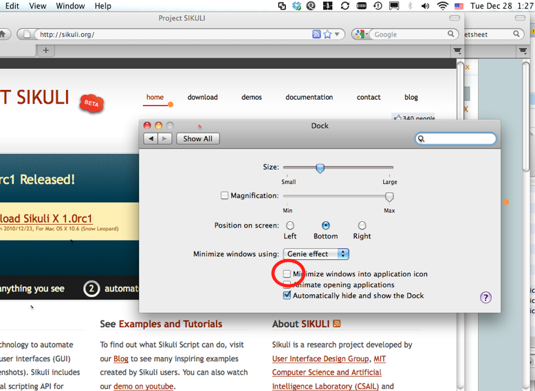
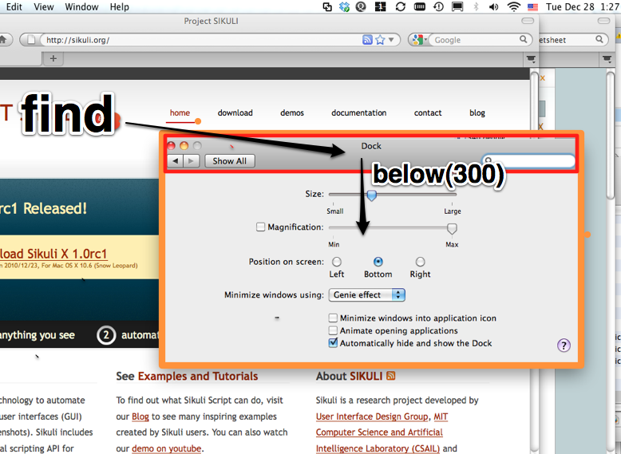
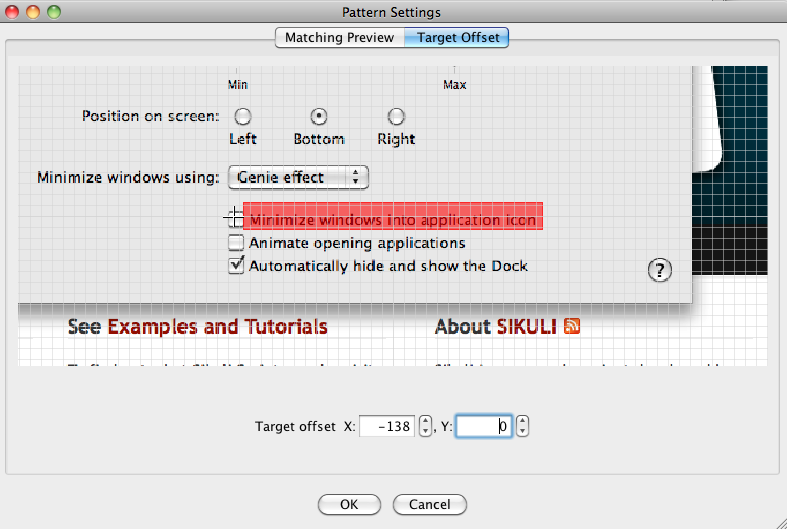

Check the Right Checkbox
========================

This tutorial demonstrates how to check a particular checkbox when there are
multiple checkboxes in a window. Consider the following window, which is the window
for setting the preferences for *Dock* on Mac, and we want to check the checkbox
indicated by the circle that reads "Minimize Windows into Application Icons."

Simply looking for the image of the checkbox like below will not work.

.. sikulicode::

	click("checkbox.png")

Sikuli does not know which checkbox we are referring to; it simply clicks on the
first one it finds. Below is what we will do instead.

First we want to obtain the region covering the content area of the *Dock* pane. One
way to accomplish this is to use a spatial operator to obtain a region below the
title bar of the *Dock* pane. The figure below illustrates this strategy.

The Sikuli script to do this is:

.. sikulicode::

	r = find("title.png").below(300)

It finds the title bar and then extend the matched region 300 pixels below, using
the spatial operator :py:meth:`below <Region.below>`. The resulting region is
assigned to the variable *r*, which is the orange rectangle in the figure above.

Next, we can search within the content region *r* for the label text of the checkbox
we want to check and click on it.

.. sikulicode::

	t = r.find("label.png")
	click(t)

If we do ``click(t)``, Sikuli will click on the center of the label. However, what
we want is to click on the right of the label where the check box is.

Sikuli IDE provides a convenient interface for specifying where to click relative to
the center of a pattern. This is known as the *target offset*. The interface is
shown below.

In this interface, we can click on the checkbox to indicate the desired location of
the click point. In this example, the offset is then determined to be -137 in x,
which means 137 pixels to the left of the center of the text label.  After selecting
the offset, the thumbnail in the script editor will be updated with a small red
cross to indicate the new click point. 

.. sikulicode::

	t = r.find("label_offset.png")
	click(t)

Then, the call ``click(t)`` will do the right thing, clicking on the checkbox
instead of the center of the text label.

