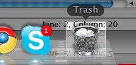
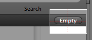
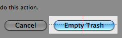
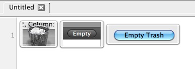
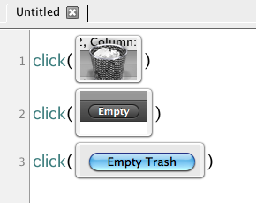

Goodbye Trash (Mac)
===================

In this tutorial, we will write a Sikuli Script to automate the operation of
clearing the content of the trash bin. On Mac OS X, this operation takes three
steps:

1.	Click on the Trash icon in the dock 
2.	Click on the Empty button in the container window 
3.	Click on the Empty Trash button to confirm

To automate this operation, first we need to capture the images of the GUI elements
that need to be clicked.

These captured images will be inserted into the Script editor.

Then, we can write a sequence of three :py:meth:`click() <Region.click>` statements
to click on the three elements that need to be clicked in order. 

Notice how closely these three lines of code are mapped to the text description of
the three-step operation earlier. We simply replace the description of each GUI
element (e.g., Trash bin) by its image directly. How intuitive it is!

Before running the script, make sure the Trash icon is visible on the screen,
otherwise Sikuli Script can not find it. 
