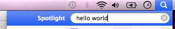
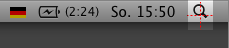
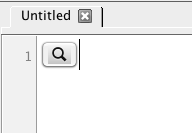
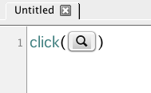
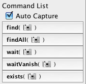
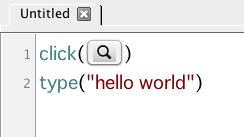

Hello World (Mac)
=================

Let us begin with a customary Hello World example!

You will learn how to capture a screenshot of a GUI element and write a Sikuli
Script to do two things:

1.	Click on that element
2.	Type a string in that element

The goal of the Hello World script is to automatically type "Hello World" into the
spotlight search box, like this: 

Now, open the Sikuli IDE. We begin by taking the screenshot of our target, the
Spotlight symbol in the upper-right corner, so that we can tell Sikuli Script what
to look for and click on. 

To simulate a mouse click on the Spotlight symbol, we are going to use the
:py:meth:`click <Region.click>` function. To tell Sikuli how the target looks like,
we need to capture the target's image on the screen.

Sikuli IDE provides two methods to capture screen images. The first method is to
click on the camera button in the toolbar. This will bring you to the screen
capturing mode.

The second method is to press a hot-key (Command + Shift + 2). Often the target
whose image you wish to capture may be covered by the Sikuli IDE's window. You can
minimize the IDE's window and use this hot-key to switch to the capturing mode.

In the screen capturing mode, the screen will look darker and freeze momentarily.
The entire desktop becomes like a canvas where you can draw a rectangle around the
target you want to capture an image of. In this case, the target is the spotlight
symbol. The cross of red dotted lines shows the center of the rectangle you just
drew.

After you have drawn (or selected) a rectangle, the image within the rectangle will
be captured and inserted into the script editor at the current cursor position.

Now, you can write the click function using this image as an argument to tell Sikuli
to click on spotlight symbol.

As a convenience, Sikuli IDE provides a *Command List* on the left panel. It
shows a list of the most often used functions. Camera icons in the functions
indicate these functions expect a captured image as an argument.

Locate the click() function in the list and click on it. If **Auto Capture** is on
(default), you will be directed to the screen capturing mode in which you can
capture an image of an interface target to be inserted into the click() function as
an argument.

The next step is to tell Sikuli to enter the string "Hello World" into spotlight's
search box, which can be done with a simple :py:meth:`type <Region.type>` function.

This function will type the string given in the argument into whichever input
control that has the focus. After clicking on the spotlight symbol, we can expect
the spotlight search box will be the input that has the focus.

Congratulations! You have just completed your first Sikuli Script. Press the run
button to see this script in action!

