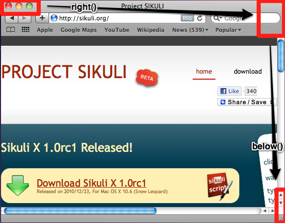

Resizing a Window
=================

This tutorial demonstrates how to use Sikuli script to resize a window by dragging
its bottom-right corner. In order to do so, you have to evaluate the current
position of this corner on the screen, move the mouse pointer to the applicable
click point and then perform one or more drag actions.

.. sikulicode::

	def resizeApp(app, dx, dy):
		switchApp(app)
		corner = find(Pattern("SafariBR.png").targetOffset(3,14))
		
		drop_point = corner.getTarget().offset(dx, dy)
		dragDrop(corner, drop_point)

	resizeApp("Safari", 50, 50)

This example defines a function "resizeApp" to enlarge a window on a Mac, and then call
the function to enlarge the size of Safari by 50x50 pixels. There are several approaches to do this task. The simplest one is directly looking
for the corner and drag it to enlarge the window. 

In addition to this simplest approach, we also want to show you more possible ways
to do the same thing. The following example demonstrates how to use the :ref:`spatial
operators <ExtendingaRegion>` to extend or restrict your searching regions.

The approach to find this corner is to first identify the most characteristic corner
of the window (mostly the one with the window buttons) and then try to find the
other relevant corners, to be sure you get the click point you need. The strategy is
illustrated below. We want to find the top-right corner, then go to the right to
find the top-right corner, then go below to find the bottom-right corner.

The script that implements this plan can be written as below:

.. sikulicode::

	#setShowActions(True) # debug
	switchApp("Safari") # get the frontmost Safari window active

	(clickOffsetX, clickOffsetY)  = (3, 18) # evaluated using the preview in IDE
	mTL = find("SafariTL.png") # find top left
	#print mTL; hover(mTL)  # debug

	mTR = mTL.nearby(200).right().find("SafariTR.png") # find top right

	#print mTR; hover(mTR) # debug
	mBR = mTR.below().find("SafariBR.png") # find bottom right, the target corner
	#print mBR # debug

	# move mouse to click point
	hover(mBR.getCenter().offset(clickOffsetX, clickOffsetY))
	#exit()  # debug

	mouseDown(Button.LEFT) # press and hold left button
	# move mouse to a new location, may be repeated with other values
	mouseMove(Env.getMouseLocation().offset(10, 10)) 
	mouseUp() # release mouse button

The workflow and the mouse-move to the click point can be compressed to a one-liner (no
check on the title in this case).

.. sikulicode::

	hover(find("SafariTL.png").nearby(200).right().find("SafariTR.png").below().find("SafariBR.png").getCenter().offset(3,18))

General comments:

* 	whenever possible the find operations are restricted to a region, that should
 	contain the relevant match, to minimize the risk, that something else is
	found. On top this speeds it up.
* 	this example could easily be turned into a helper function, where all
	images and variables can be given as parameters.
* 	the click point was evaluated in the IDE using the preview window, but
	then put in the code for flexibility and readability.
* 	the low level mouse functions are used, so you would be more
	flexible with continuous movements.
* 	the development approach was, to first get everything running
	to evaluate the relevant corner. In this phase, the comments
	having a "# debug" were all uncommented to have some feedback.
	Especially setShowActions() and exit() are very helpful. 

