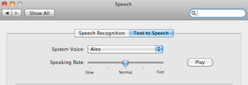
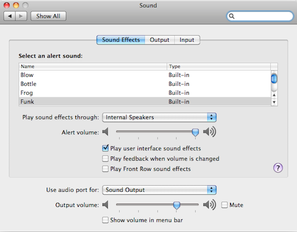

Working with Sliders
====================

In this tutorial, we will learn how to use :py:meth:`dragDrop() <Region.dragDrop>`
and :ref:`spatial operators <ExtendingaRegion>` by writing a number of scripts to
manipulate sliders.

Suppose we wish to lower the speaking rate of the Text to Speech function. We want
to drag the slider to the slow side in the Speech preferences window shown below. 

The function that can perform the dragging is :py:meth:`dragDrop()
<Region.dragDrop>`. This function takes two images as arguments. The first image
describes the source GUI object to drag and the second image describes the
appearance of the destination location where the GUI object should be dragged to and
dropped.

Let us capture the source and destination images respectively.

.. sikulicode::

	dragDrop("thumb.png", "slow.png")

What happen if there are more than two sliders. How can we make sure the right
slider is dragged? The above example works because the particular window only has
one slider. How can we deal with cases when there are several instances of similar
looking GUI components? Let us consider the Sound preferences window shown below. 

Suppose we wish to lower the Alert volume. To make sure Sikuli Script drags the
right slider, we need a way to tell Sikuli Script to look for the one that is to the
right of the Alert volume label, not the one next to the Output volume label. Sikuli
Script provides a set of spatial operators to do exactly this. Here we will apply
the :py:meth:`right() <Region.right>` operator as follows.

.. sikulicode::

	t = find("alert.png").right().find("thumb.png")

This statement tells Sikuli Script to first find the Alert volume label and then
find the slider thumb only within the region strictly to the right of the result of
the first find. The slider thumb found is then stored in the variable t. Now that we
have identified the desired slider thumb, we can call :py:meth:`dragDrop()
<Region.dragDrop>` to drag it to the left by giving the image of the Alter volume as
the target.

.. sikulicode::

	dragDrop(t, "alert.png")

In the above example, we use the image of the Alert volume label to implicitly guide
the direction of dragging to the left. It is also possible to use relative
coordinates to explicitly drag to the left, as shown below. 

.. sikulicode::

	dragDrop(t, [t.x - 200, t.y])

Here, the (x,y) coordinates of the slider thumb are accessible as the attributes of
t. We can thus calculate the position 200 pixels to the left of t and ask Sikuli
Script to drag the thumb to that position. 

