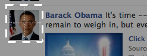
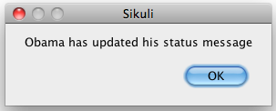
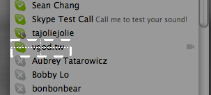
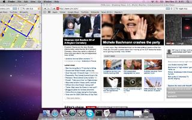
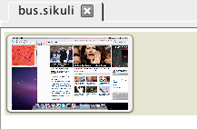
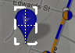

Desktop Surveillance
====================

Sikuli Script can be used to perform **desktop surveillance**. In this tutorial, we will
go through a number of exercises to create scripts that can monitor the screen and
notify us when certain interesting visual event happens. 

Facebook App
------------

The first exercise is to create a Facebook app to periodically check our Facebook
homepage visually  and see if a particular friend has recently updated the status
message. One easy way to detect this event is to look for the friend's face image on
our Facebook homepage. If found, the friend must have posted a new status message.
If not found, we should check back again in a few moments.

Let's implement this operation using a ``while:`` loop. First we need to capture a
screenshot of the friend's face image. 

To check if the friend's face can be seen on the screen, we use :py:meth:`exists()
<Region.exists>`,
which returns True when the face image is found. We set the looping condition to Not
Found so that the while loop will terminate only when the face image is found. We
add a :py:func:`sleep(n) <sleep>` statement in the body of the loop to introduce a 5
second interval between attempts to look for the face image on the screen.

.. sikulicode::

	while not exists("obama.png"):
		sleep(5)

Alternatively, Sikuli provides a convenient :py:meth:`wait() <Region.wait>` function
that periodically checks the screen to wait for a given image pattern to appear.
Using wait(), the above code can be rewritten as:

.. sikulicode::

	wait("obama.png", FOREVER)

The constant *FOREVER* means we want Sikuli to wait indefinitely. If we do not want
to wait forever, we can replace *FOREVER* with a number to indicate the number of
seconds to wait until Sikuli should giveup. 

.. sikulicode::

	wait("obama.png", 3600) # wait for an hour

After the while loop exits or the wait function returns, we can call
:py:func:`popup` to display a notification message. 

.. sikulicode::

	popup("Obama has updated his message")

This will display a popup message that looks like below:

Now we can run this Sikuli Facebook App, sit back and relax, and get notified when
our friend updates his message.

Skype App
---------

In the previous exercise, we wrote a script to detect an image's appearance. In this
exercise, we will do the opposite --- *detecting the disappearance of a visual
pattern*.

Skype is a great tool that allows us to stay in close contact with our friends even
if they are in remote parts of the world. However, there might be some unfortunate
circumstances we may want to avoid being seen online by a certain individual.
Perhaps the individual talks too much. Perhaps we owe the individual some money. It
would be nice to know when the individual is offline so that it is safe to get
online. While Skype does provide a feature to notify us when an individual is
online, there is no notification feature when the opposite happens.

An automatic logoff notifier would be desirable to deal with this situation. Let us
build this tool using Sikuli Script. Notice that if an individual is no longer
online, the combined visual pattern of the green status icon and the individual's
screen name will disappear. Thus, we can take a screenshot that includes both the
green icon and the screen name as follows.

Then, we can write a Sikuli Script to watch for the disappearance of the screenshot
image we just captured. 

.. sikulicode::

	while exists("vgod.png"):
		sleep(5)

	popup("vgod just logged off")

This script is very similar to the one in the previous exercise. The only difference
is the removal of the NOT operator from the condition statement for the while loop,
since we are trying to do the opposite. 

Another way to wait for the disappearance of an image is to use the
:py:meth:`waitVanish() <Region.waitVanish>` function. The above script can be
rewritten as follows:

.. sikulicode::

	waitVanish("vgod.png", FOREVER)
	popup("vgod just logged off")

Bus Arrival Notifier
--------------------

The third exercise is to build a bus arrival notification tool. For many bus riders,
online GPS-based tracking services are very useful. Instead of patiently standing
outside at a bust stop, braving the freezing wind in the winter or scorching sun in
the summer, riders can sit comfortably inside in front of their computers, checking
emails, updating Facebook status, or watching YouTube?  videos, or what have you.
They only need to look at the map every few moments to check the location of the bus
symbol on the map. Only when the bus is close enough do they have to finally get out
and walk to the bus top.

Since we care about whether the bus is getting close to the stop, we only need to
look at the neighborhood around the stop. Thus, we can resize the browser to show
just that portion of the map, while leaving a lot of screen space to do something
else, in this case, reading CNN news. 

Let us write a Sikuli Script to do the bus tracking for us. It is possible to define
a region and ask Sikuli Script to focus only on that region to search for a
particular visual pattern. This way, Sikuli don't have to waste precious computing
cycles scanning the whole screen. To do so, let us click on the "select a region"
button in the toolbar as indicated below. 

The entire screen will freeze and turn darker, similar to what happen in the screen
capture mode. Simply draw a rectangle to cover the entire neighborhood map. The
region covered by this rectangle is visually represented as a thumbnail image of the
entire desktop where the region is shaded in red.

Next, we capture the screenshot image of the bus symbol so that we can tell Sikuli
Script to watch for its appearance.

Now. we can write the following script to check the map and watch for the appearance
of a bus symbol:

.. sikulicode::

	while not "region.png".inside().exists("bus.png"):
		sleep(5)
	popup("bus has arrived")

Interpreting the meaning of the while loop is straightforward---while it is not the
case that a bus symbol can be found inside the region, sleep for 5 seconds. In other
words, the while loop will exit only when the bus symbol is found inside the region.
Then, the popup statement will be executed to notify us the bus has arrived. 

Again, the same effect can be achived using :py:meth:`wait() <Region.wait>`. The
script can be rewritten as:

.. sikulicode::

	"region.png".inside().wait("bus.png",FOREVER)
	popup("bus has arrived")

	
