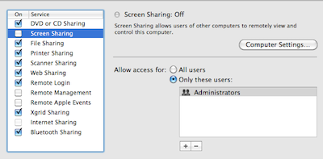
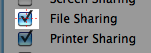
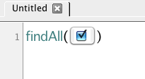
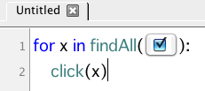

Uncheck All Checkboxes
======================

In this tutorial, we will demonstrate how to use a ``for`` loop to interact with
multiple instances of a GUI component. Suppose we want to uncheck all the check
boxes in a window, such as the Sharing preferences window shown below:

Unfortunately, there is no "uncheck all" function available. The solution? Write a
Sikuli Script to look for ALL the checked items and uncheck them automatically. The
function needed for this operation is :py:meth:`findAll() <Region.findAll>`.

First, let's capture the screenshot image of a checked item. 

Then, we can insert the image into the ``findAll()`` function. 

``findAll()`` searches the entire screen for all the matching visual patterns and
returns a list of locations of those similar patterns. This capability allows us to
obtain all the checked items are on the screen. Then, we can simply write a for loop
in standard Python syntax and call ``click()`` on each element in the list. 

When this script is executed, Sikuli will find all the items that are currently
checked and click on each item one by one in the loop.
